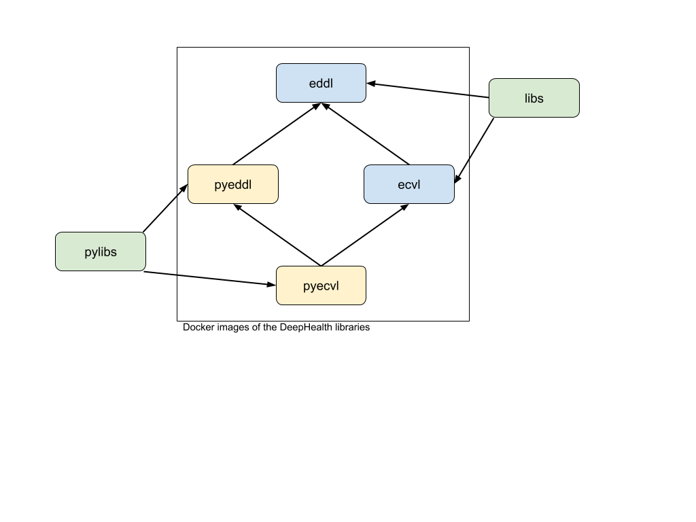

 


# DeepHealth docker-libs

Docker images to develop and run software based on the [EDDL](https://github.com/deephealthproject/eddl) and [ECVL](https://github.com/deephealthproject/ecvl) libraries and their respective Python interfaces ([PyEDDL](https://github.com/deephealthproject/pyeddl) and [PyECVL](https://github.com/deephealthproject/pycvl)).


## TL;DR

    docker pull dhealth/pylibs:latest

or

    docker pull dhealth/pylibs-toolkit:latest


## Configuring your host for NVIDIA GPUs

While the Docker images package the required CUDA runtime environment, you must have
installed the NVIDIA driver and the docker-nvidia runtime on the host machine.

EDDLL requires CUDA version >= 9.


## Available Container Images



The available runtime images and the relation between them is shown in the image
above.

### Complete runtime images:  `dhealth/libs` and `dhealth/pylibs`

The `libs` and `pylibs` images package the DeepHealth runtime for
C++ and Python programs, respectively.  Generally speaking, we recommend using
one of these images.


### Library-specific images

Every library has a corresponding image repository on DockerHub:

 - [`dhealth/eddl`](https://hub.docker.com/r/dhealth/eddl)
 - [`dhealth/ecvl`](https://hub.docker.com/r/dhealth/ecvl)
 - [`dhealth/pyeddl`](https://hub.docker.com/r/dhealth/pyeddl)
 - [`dhealth/pyecvl`](https://hub.docker.com/r/dhealth/ecvl-toolkit)


These images closely track the development of the various libraries. They are
automatically generated by the CI pipeline and tagged as follows:

  * `latest`:  latest successful build of the image;
  * `<release tag>`: library releases have their own image tag;
  * `<commit id>`:  latest image of the specific library's git commit id;
  * `<commit id>_<build id>`:  image produced by the specific run of the
    continuous integration pipeline on the specific library's git commit id.

The version of the dependent libraries included in these images is determined by
the submodules pinned in the specific library repository.

### Toolkit images

Toolkit images build on the base runtime images by adding build-time
dependencies (e.g., library headers, compilers, etc.).  You can use these to
build your own software or rebuild the DeepHealth libraries from source.

**For each of the DeepHealth runtime images mentioned above there is a
corresponding toolkit image.**


### Summary of DeepHealth Docker images

| Runtime image | Toolkit image | Library tracked | Dependencies included |
|---------------|---------------|---------------|---------------|
| dhealth/eddl | dhealth/eddl-toolkit | EDDLL | |
| dhealth/ecvl | dhealth/ecvl-toolkit | ECVL | EDDLL |
| dhealth/pyeddl | dhealth/pyeddl-toolkit | PyEDDLL | EDDLL |
| dhealth/pyecvl | dhealth/pyecvl-toolkit | PyECVL | PyEDDLL, EDDLL and ECVL |
| dhealth/libs | dhealth/libs-toolkit | EDDLL+ECVL | |
| dhealth/pylibs | dhealth/pylibs-toolkit | PyECVL + PyEDDLL | EDDLL and ECVL |


### Examples

#### Image tags

Every tag and commit id you see in the git repository has a corresponding image tag
  - e.g., PyECVL [version 0.1.0](https://github.com/deephealthproject/pyecvl/tree/0.1.0) corresponds to the image tag [dhealth/pyecvl:0.1.0](https://hub.docker.com/layers/dhealth/pyecvl/0.1.0/)
  - e.g., PyECVL at [commit id 23a79c5](https://github.com/deephealthproject/pyecvl/tree/23a79c5b6ba39a5049901933edff2ca372713df7) corresponds to the image tag [dhealth/pyecvl:23a79c5](https://hub.docker.com/layers/dhealth/pyecvl/23a79c5/images/sha256-bea02aa37dbb4f0f987b56d5c33d319e4018c809b562bca09bd1df0b4c755425?context=explore) (use the first 7 characters of the commit id)


#### Building code with a toolkit image

You can build and run DeepHealth-based code on a host machine without installing any
dependencies or tool by using a toolkit image.

```bash
$ docker run -it -u $(id -u) -v $(pwd):/my_examples --rm \
    dhealth/eddl-toolkit:latest /bin/bash
$ cd /my_examples/
$ g++ 6_mnist_auto_encoder.cpp -std=c++11 -leddl -pthread -o example
$ ./example
```

#### Open a shell with DeepHealth Python modules

```bash
$ docker run -it --rm dhealth/pylibs /usr/bin/python3
Python 3.6.9 (default, Apr 18 2020, 01:56:04)
[GCC 8.4.0] on linux
Type "help", "copyright", "credits" or "license" for more information.
>>> import pyeddl
>>> pyeddl.VERSION
'0.6.0'
```

#### Open a shell with DeepHealth Python modules and access to your data

```bash
$ docker run -it --rm -v /mnt/vol/data:/data:ro dhealth/pylibs /usr/bin/python3
Python 3.6.9 (default, Apr 18 2020, 01:56:04)
[GCC 8.4.0] on linux
Type "help", "copyright", "credits" or "license" for more information.
>>> import pyeddl, os
>>> pyeddl.VERSION
'0.6.0'
>>> os.listdir('/data')
['mnist.yml', 'testing', 'testing_label.txt', 'training', 'training_label.txt']
```


## How to build, test and publish

A `Makefile` allows to easily compile, test and publish the Docker images. Type `make help` to see the available `Makefile` targets, i.e.:

```bash
version                        Output the current version of this Makefile
help                           Show help
dependency_graph               make a dependency graph of the involved libraries
build                          Build all Docker images
build_eddl_toolkit             Build 'eddl-toolkit' image
build_ecvl_toolkit             Build 'ecvl-toolkit' image
build_libs_toolkit             Build 'libs-toolkit' image
build_eddl                     Build 'eddl' image
build_ecvl                     Build 'ecvl' image
build_libs                     Build 'libs' image
build_pyeddl_toolkit           Build 'pyeddl-toolkit' image
build_pyecvl_toolkit           Build 'pyecvl-toolkit' image
build_pylibs_toolkit           Build 'pylibs-toolkit' image
build_pyeddl                   Build 'pyeddl' image
build_pyecvl                   Build 'pyecvl' image
build_pylibs                   Build 'pylibs' image
test                           Test all docker images
test_eddl                      Test 'eddl' image
test_eddl_toolkit              Test 'eddl-toolkit' image
test_ecvl                      Test 'ecvl' image
test_ecvl_toolkit              Test 'ecvl-toolkit' image
test_pyeddl                    Test 'pyeddl' image
test_pyeddl_toolkit            Test 'pyeddl-toolkit' images
test_pyecvl                    Test 'pyecvl' image
test_pyecvl_toolkit            Test 'pyecvl-toolkit' image
push                           Push all images
push_libs                      Push 'libs' image
push_libs_base                 Push 'lib-base' image
push_eddl                      Push 'eddl' image
push_ecvl                      Push 'ecvl' image
push_libs_toolkit              Push 'libs-toolkit' image
push_libs_base_toolkit         Push 'libs-base-toolkit' image
push_eddl_toolkit              Push 'eddl-toolkit' image
push_ecvl_toolkit              Push 'ecvl-toolkit' image
push_pylibs                    Push 'pylibs' image
push_pyeddl                    Push 'pyeddl' image
push_pyecvl                    Push 'pyecvl' image
push_pylibs_toolkit            Push 'pylibs-toolkit' image
push_pyeddl_toolkit            Push 'pyeddl-toolkit' image
push_pyecvl_toolkit            Push 'pyecvl-toolkit' image
publish                        Publish all images to a Docker Registry (e.g., DockerHub)
publish_libs                   Publish 'libs' image
publish_eddl                   Publish 'eddl' image
publish_ecvl                   Publish 'ecvl' image
publish_libs_toolkit           Publish 'libs-toolkit' image
publish_eddl_toolkit           Publish 'eddl-toolkit' image
publish_ecvl_toolkit           Publish 'ecvl-toolkit' image
publish_pylibs                 Publish 'pylibs' image
publish_pyeddl                 Publish 'pyeddl' image
publish_pyecvl                 Publish 'pyecvl' image
publish_pylibs_toolkit         Publish 'pylibs-toolkit' image
publish_pyeddl_toolkit         Publish 'pyeddl-toolkit' image
publish_pyecvl_toolkit         Publish 'pyecvl-toolkit' image
docker-login                   Login to the Docker Registry
clean_eddl_sources             clean repository containing EDDL source code
clean_ecvl_sources             clean repository containing ECVL source code
clean_pyeddl_sources           clean repository containing PyEDDL source code
clean_pyecvl_sources           clean repository containing PyECVL source code
clean_libs_sources             clean repository containing libs source code
clean_pylibs_sources           clean repository containing pylibs source code
clean_sources                  clean repository containing source code
clean_logs                     clean logs
```

Edit the file `settings.conf` to customize your images (e.g., software revision, Docker registry, etc.)

